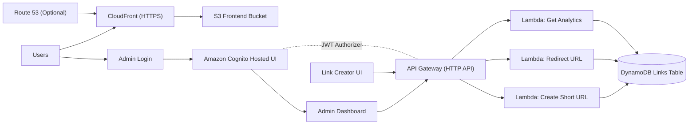

# CloudLinks

Open-source, serverless link shortener with an authenticated analytics dashboard.

CloudLinks is built for builders who want a production-style AWS project that is easy to run, easy to learn from, and strong enough for real portfolio and resume use.

## Why CloudLinks

- Serverless by default: Lambda + API Gateway + DynamoDB
- Secure admin analytics: Cognito login + JWT-protected API
- Modern frontend: responsive UI + dashboard charts
- Production delivery path: S3 + CloudFront + optional Route 53 custom domain + HTTPS
- CI/CD ready: GitHub Actions with AWS OIDC deploys

## Architecture



## Tech Stack

- `AWS Lambda`
- `Amazon API Gateway (HTTP API)`
- `Amazon DynamoDB`
- `Amazon Cognito`
- `Amazon S3`
- `Amazon CloudFront`
- `Amazon Route 53` (optional custom domain)
- `AWS Certificate Manager` (TLS for custom domain)
- `AWS SAM` / `CloudFormation`
- `GitHub Actions` (OIDC-based deploy)

## Repository Layout

```text
.
|- frontend/
|  |- index.html
|  |- app.js
|  |- styles.css
|  |- admin-login.html
|  |- admin-login.css
|  |- admin-login.js
|  |- admin.html
|  |- admin.css
|  |- admin.js
|  |- auth.js
|  `- config.example.js
|- src/functions/
|  |- create_short_url/app.py
|  |- redirect_url/app.py
|  `- get_analytics/app.py
|- events/
|- template.yaml
`- .github/workflows/aws-sam-cicd.yml
```

## Features

### Public App
- Create short URLs (`POST /shorten`)
- Redirect short links (`GET /{shortCode}`)
- Click count tracking

### Admin Experience
- Cognito-based sign in
- Session storage + idle timeout handling
- Protected analytics endpoint (`GET /admin/analytics`)
- Dashboard cards + charts + top links table

### Platform/DevEx
- Infrastructure as Code with SAM
- Optional custom domain with Route 53 + ACM + CloudFront
- GitHub Actions CI/CD with OIDC (no static AWS keys required)

## API

### `POST /shorten`
Request:
```json
{ "url": "https://example.com" }
```

Response:
```json
{
  "shortCode": "a1b2Cd",
  "shortUrl": "https://<api-id>.execute-api.<region>.amazonaws.com/a1b2Cd"
}
```

### `GET /{shortCode}`
Redirects to original URL and increments click count.

### `GET /admin/analytics`
Requires `Authorization: Bearer <cognito_access_token>`.  
Returns summary metrics and top links.

## Quickstart

### 1) Prerequisites

- AWS account
- AWS CLI configured (`aws configure`)
- SAM CLI
- Python 3.11+

### 2) Build

```bash
sam build
```

### 3) Deploy (guided)

```bash
sam deploy --guided
```

Recommended values:
- `Stack Name`: `cloudlinks-stack`
- `Region`: e.g. `ap-south-1`
- `FrontendDomainName`: custom domain or empty
- `FrontendHostedZoneId`: hosted zone ID or empty
- `FrontendAcmCertificateArn`: `us-east-1` certificate ARN or empty
- `AdminCallbackUrl`: dashboard callback URL
- `AdminLogoutUrl`: admin login URL

### 4) Configure frontend runtime

```bash
cp frontend/config.example.js frontend/config.js
```

Set:
- `API_BASE_URL`
- `COGNITO_DOMAIN`
- `COGNITO_CLIENT_ID`
- `COGNITO_REDIRECT_URI`
- `COGNITO_LOGOUT_URI`

### 5) Upload frontend and invalidate CDN

```bash
aws s3 sync frontend/ s3://<FrontendBucketName> --delete
aws cloudfront create-invalidation --distribution-id <FrontendCloudFrontDistributionId> --paths "/*"
```

## Create First Admin User

```bash
aws cognito-idp admin-create-user \
  --user-pool-id <CognitoUserPoolId> \
  --username admin@example.com \
  --user-attributes Name=email,Value=admin@example.com Name=email_verified,Value=true \
  --temporary-password TempPass123!

aws cognito-idp admin-set-user-password \
  --user-pool-id <CognitoUserPoolId> \
  --username admin@example.com \
  --password StrongPass123! \
  --permanent
```

## CloudFormation Outputs

You will use these after deploy:

- `CloudLinksApiUrl`
- `CognitoHostedUiDomain`
- `CognitoUserPoolId`
- `CognitoUserPoolClientId`
- `FrontendBucketName`
- `FrontendCloudFrontDistributionId`
- `FrontendCloudFrontDomainName`
- `FrontendUrl`

## CI/CD (GitHub Actions)

Workflow file:
- `.github/workflows/aws-sam-cicd.yml`

Behavior:
- PR to `main`: validate + build
- Push to `main`: deploy stack, publish frontend, invalidate CloudFront

### Required GitHub Secret

- `AWS_DEPLOY_ROLE_ARN`

### Required GitHub Variables

- `AWS_REGION`
- `STACK_NAME`
- `ADMIN_CALLBACK_URL`
- `ADMIN_LOGOUT_URL`
- `FRONTEND_DOMAIN_NAME`
- `FRONTEND_HOSTED_ZONE_ID`
- `FRONTEND_ACM_CERTIFICATE_ARN`

## Local Function Tests

```bash
sam local invoke CreateShortUrlFunction --event events/create-short-url.json
sam local invoke RedirectUrlFunction --event events/redirect-url.json
sam local invoke GetAnalyticsFunction --event events/admin-analytics.json
```

## Security Notes

- Admin analytics API is protected with Cognito JWT authorizer.
- Frontend assets are served through CloudFront with S3 origin access control.
- No long-lived AWS access keys are required for CI/CD (OIDC role assumption).

## Resume-Ready Highlights

- Designed and shipped a serverless URL shortener using AWS Lambda, API Gateway, and DynamoDB.
- Implemented secure admin authentication with Cognito and JWT-protected analytics APIs.
- Deployed globally over CloudFront with HTTPS and optional custom domain integration.
- Automated deployments using GitHub Actions with AWS OIDC federation.

## Roadmap

- Multi-environment deployments (`dev`, `staging`, `prod`)
- WAF policies and threat analytics
- Richer analytics (time-series + campaign tagging)
- Team-based admin RBAC

## License

MIT

